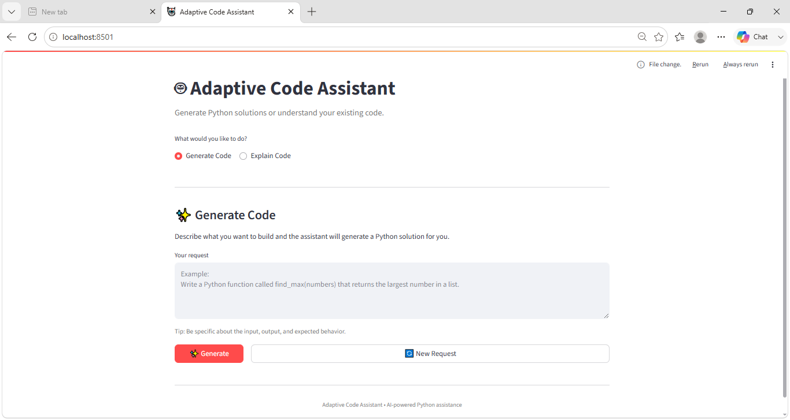
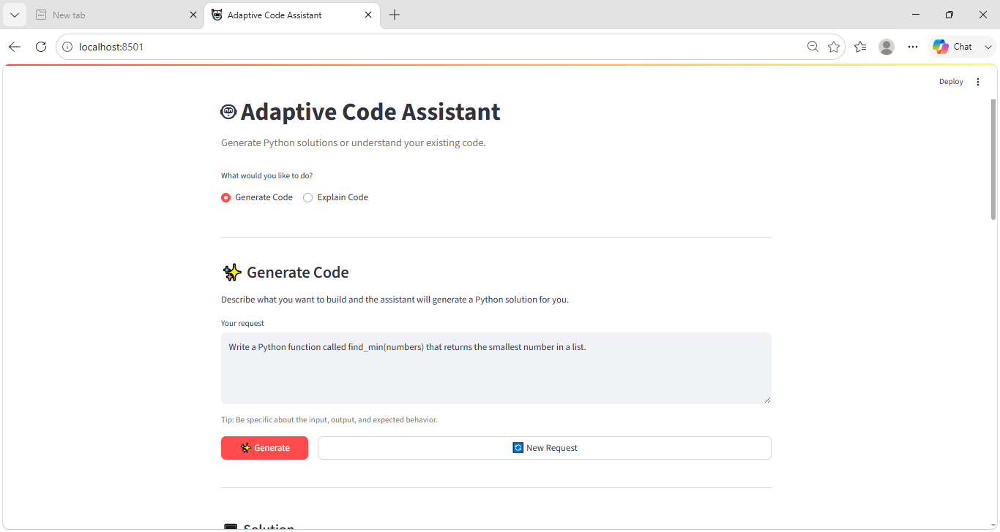
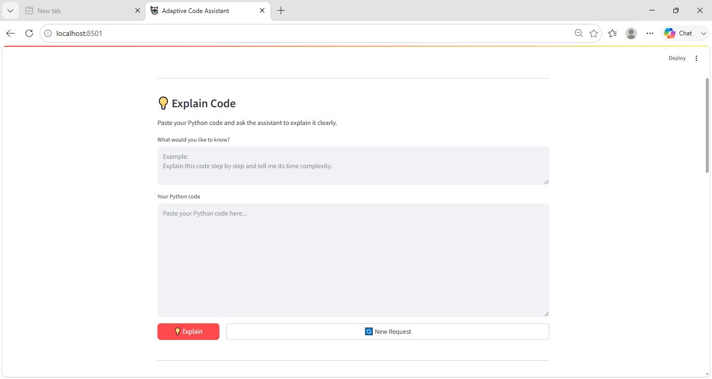

# 💻 Adaptive Code Assistant

An intelligent Python programming assistant that combines **LLM-based routing, Retrieval-Augmented Generation (RAG), semantic search, and direct LLM generation** to provide adaptive code-generation and code-explanation capabilities.

The system dynamically decides how to handle each user request and selects the most appropriate workflow.

---

## 📌 Overview

Adaptive Code Assistant is an end-to-end AI application designed to assist developers with Python programming tasks.

The assistant can:

- Generate Python code from natural-language requests.
- Explain user-provided Python code.
- Retrieve similar programming examples from a knowledge base.
- Evaluate whether retrieved examples are relevant.
- Use relevant examples through a RAG-based generation workflow.
- Fall back to direct LLM generation when retrieved examples are not useful.
- Run generated Python code directly from the Streamlit interface.
- Copy generated code easily from the UI.

The project is designed with a modular architecture so that individual components can be replaced, improved, or extended independently.

---

# ✨ Features

## 1. Code Generation

Users can describe a programming problem in natural language.

Example:

```text
Write a Python function called find_max(numbers)
that returns the largest number in a list.
```

The assistant generates:

- A complete Python solution
- An explanation
- Time complexity
- Space complexity
- Relevant edge cases when applicable

---

## 2. Code Explanation

Users can provide existing Python code and ask the assistant to explain it.

The explanation workflow analyzes the provided code directly without using the retrieval pipeline.

The generated explanation can include:

- What the code does
- Step-by-step logic
- Important functions and variables
- Algorithm used
- Time complexity
- Space complexity
- Bugs and edge cases
- Possible improvements
- Examples when useful

---

## 3. Intelligent Request Routing

The system uses an LLM Router to classify the user's request.

Currently supported routes:

```text
code_generation
code_explanation
```

The router then sends the request to the corresponding workflow.

---

# 🏗️ System Architecture

The high-level architecture is:

```text
                    User Request
                         │
                         ▼
                    ┌─────────┐
                    │   LLM   │
                    │ Router  │
                    └────┬────┘
                         │
              ┌──────────┴──────────┐
              │                     │
              ▼                     ▼
       Code Explanation       Code Generation
          Workflow               Workflow
              │                     │
              ▼                     ▼
             LLM                Retriever
                                    │
                                    ▼
                            Retrieval Evaluator
                                    │
                           ┌────────┴────────┐
                           │                 │
                       Relevant?        Not Relevant
                           │                 │
                           ▼                 ▼
                          RAG             Direct LLM
                           │                 │
                           └────────┬────────┘
                                    │
                                    ▼
                              Final Response
                                    │
                                    ▼
                              Streamlit UI
```

---

# 🔄 Code Generation Workflow

The code-generation pipeline follows these steps:

```text
User Request
     │
     ▼
Retriever
     │
     ▼
Retrieve Top-K Examples
     │
     ▼
Retrieval Evaluator
     │
     ├─────────────── Relevant ───────────────┐
     │                                        │
     ▼                                        ▼
Not Relevant                              RAG Prompt
     │                                        │
     ▼                                        │
Direct LLM Prompt                            │
     │                                        │
     └────────────────┬───────────────────────┘
                      │
                      ▼
                     LLM
                      │
                      ▼
                Final Response
```

This makes the assistant adaptive because it does not blindly use retrieved context.

---

# 🧠 Retrieval-Augmented Generation

The project uses a RAG pipeline to retrieve semantically similar programming examples.

The retrieval pipeline is:

```text
Programming Dataset
       │
       ▼
Document Loader
       │
       ▼
Document Chunker
       │
       ▼
Embedding Model
       │
       ▼
FAISS Vector Store
       │
       ▼
Similarity Search
       │
       ▼
Top-K Documents
```

When a user submits a programming request, the retriever searches the vector store for similar examples.

The retrieved documents are then passed to the Retrieval Evaluator.

---

# 🔎 Retrieval Evaluator

The Retrieval Evaluator uses an LLM to determine whether the retrieved examples are actually useful for the user's request.

It classifies the retrieved context as:

```text
RELEVANT
```

or:

```text
NOT_RELEVANT
```

If the examples are relevant:

```text
Query + Retrieved Context
          ↓
       RAG Prompt
          ↓
          LLM
```

If they are not relevant:

```text
Query
  ↓
Direct Prompt
  ↓
LLM
```

This prevents unrelated retrieved examples from unnecessarily influencing the generated answer.

---

# 🗂️ Knowledge Ingestion Pipeline

The project includes a knowledge-ingestion pipeline for programming examples.

The main stages are:

### 1. Loading

Programming examples are loaded into LangChain `Document` objects.

### 2. Chunking

Large documents are divided into smaller chunks using:

```text
RecursiveCharacterTextSplitter
```

The chunk size and overlap are configurable through the project settings.

### 3. Embedding

Each chunk is converted into a numerical vector using the configured embedding model.

### 4. Vector Storage

The embeddings are stored in a local FAISS vector store.

### 5. Retrieval

The vector store is queried using semantic similarity.

---

# 🧩 Project Structure

```text
adaptive-code-assistant/
│
├── .venv/
├── assets/
├── config/
├── data/
├── logs/
├── prompts/
│
├── src/
│   ├── embeddings/
│   │   └── embedding_model.py
│   │
│   ├── evaluator/
│   │   └── retrieval_evaluator.py
│   │
│   ├── ingestion/
│   │   ├── base_loader.py
│   │   ├── chunker.py
│   │   ├── humaneval_loader.py
│   │   └── loader.py
│   │
│   ├── knowledge/
│   │   └── knowledge_updater.py
│   │
│   ├── llm/
│   │   └── llm_client.py
│   │
│   ├── prompt/
│   │   └── prompt_builder.py
│   │
│   ├── retriever/
│   │   └── retriever.py
│   │
│   ├── router/
│   │   └── ...
│   │
│   ├── utils/
│   │   ├── helpers.py
│   │   └── logger.py
│   │
│   ├── vectorstore/
│   │   └── vector_store.py
│   │
│   ├── workflows/
│   │   ├── explanation_workflow.py
│   │   └── generation_workflow.py
│   │
│   └── assistant.py
│
├── .env
├── .gitignore
├── app.py
├── README.md
├── requirements.txt
├── test.py
├── test_evaluator_llm.py
└── test_rag_generation.py
```

---

# 🖥️ User Interface

The project provides a Streamlit-based user interface.

The UI allows users to:

- Enter a programming request.
- Select between code generation and code explanation.
- Paste Python code for explanation.
- View the generated response.
- Copy generated code.
- Run generated Python code.
- Start a new request.
## 🖥️ Application Screenshots

### Main Interface



### Code Generation



### Code Explanation




The application can be launched locally using:

```bash
streamlit run app.py
```

Typical local URL:

```text
http://localhost:8501
```

---

# ⚙️ Installation

## 1. Clone the repository

```bash
git clone <https://github.com/mahaelbad/adaptive-code-assistant.git>
cd adaptive-code-assistant
```

## 2. Create a virtual environment

```bash
python -m venv .venv
```

## 3. Activate the virtual environment

### Windows PowerShell

```powershell
.venv\Scripts\Activate.ps1
```

### Windows CMD

```cmd
.venv\Scripts\activate
```

## 4. Install dependencies

```bash
pip install -r requirements.txt
```

---

# 🔐 Environment Variables

Create a `.env` file in the project root.

Example:

```env
OPENROUTER_API_KEY=your_api_key_here
```

Additional configuration values can be managed through the project's configuration system.

> Never commit API keys or other secrets to GitHub.

---

# ▶️ Running the Application

Start the Streamlit application:

```bash
streamlit run app.py
```

The application will start locally.

---

# 🧪 Testing

The project contains test scripts for important components and workflows.

Examples include:

```bash
python test.py
```

```bash
python test_evaluator_llm.py
```

```bash
python test_rag_generation.py
```

These tests can be used to verify individual components and the RAG generation pipeline.

---

# 📊 Example

## Code Generation

### User Request

```text
Write a Python function called find_max(numbers)
that returns the largest number in a list.
```

### Generated Solution

```python
def find_max(numbers):
    if not numbers:
        raise ValueError("find_max() arg is an empty sequence")

    max_value = numbers[0]

    for number in numbers[1:]:
        if number > max_value:
            max_value = number

    return max_value
```

### Complexity

```text
Time Complexity: O(n)
Space Complexity: O(1)
```

---

# 💡 Design Principles

## Modularity

Each responsibility is separated into its own component:

```text
Router
Retriever
Evaluator
LLM Client
Embedding Model
Vector Store
Workflows
UI
```

This makes the system easier to maintain and extend.

## Separation of Concerns

The UI does not directly implement retrieval or LLM logic.

Instead:

```text
Streamlit
    ↓
AdaptiveCodeAssistant
    ↓
Router / Workflows
    ↓
Retrieval / LLM Components
```

## Fail-Safe Retrieval

If retrieval evaluation fails or retrieved examples are not considered relevant, the system falls back to direct LLM generation.

This prevents retrieval failures from completely stopping the application.

---

# 🛠️ Technologies

The project uses technologies including:

- Python
- Streamlit
- LangChain
- FAISS
- Sentence Transformers
- LLM APIs
- Retrieval-Augmented Generation (RAG)
- Semantic Search
- Python logging
- Virtual environments

---

# 🚀 Future Improvements

Possible future improvements include:

- Streaming LLM responses.
- Better retrieval evaluation using similarity scores.
- Hybrid keyword + vector search.
- Automatic code-test generation.
- Code quality evaluation.
- Support for additional programming languages.
- Conversation history.
- Persistent user sessions.
- More advanced observability and monitoring.
- Automated evaluation benchmarks.
- Secure sandboxed code execution.

---

# ⚠️ Current Limitations

The quality of generated responses depends on the selected LLM provider and model.

The retrieval evaluator also depends on LLM availability. If the evaluator cannot obtain a response, the system safely falls back to direct generation.

Code execution should only be performed with trusted or sandboxed code in production environments.

---

# 👩‍💻 Author

Developed as an end-to-end AI software engineering project focused on:

- LLM Applications
- Retrieval-Augmented Generation
- Semantic Retrieval
- AI-Assisted Programming
- Modular Software Architecture
- Production-Oriented Application Design
